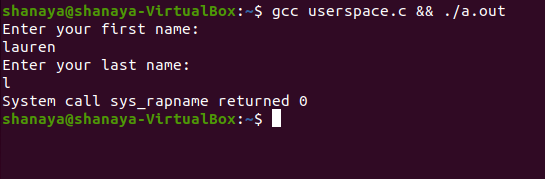
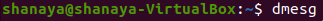

# cmsi387projKeAnnaLaurenShanaya
This is the repo where all the important documents for our CMSI 387 semester project live :) 

## For our semester project, we made a new system call to the Linux kernel. The system call takes in a first name and last name as user input and generates a Rapper Name to match. Here is what it looks like:

First, the user compiles the code and the program prompts the user for a first and last name

Then, the user checks the kernel logs for their unique Rapper Name!

