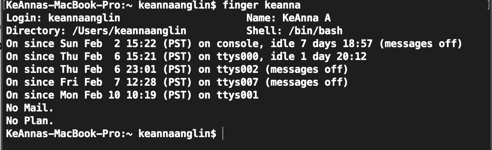
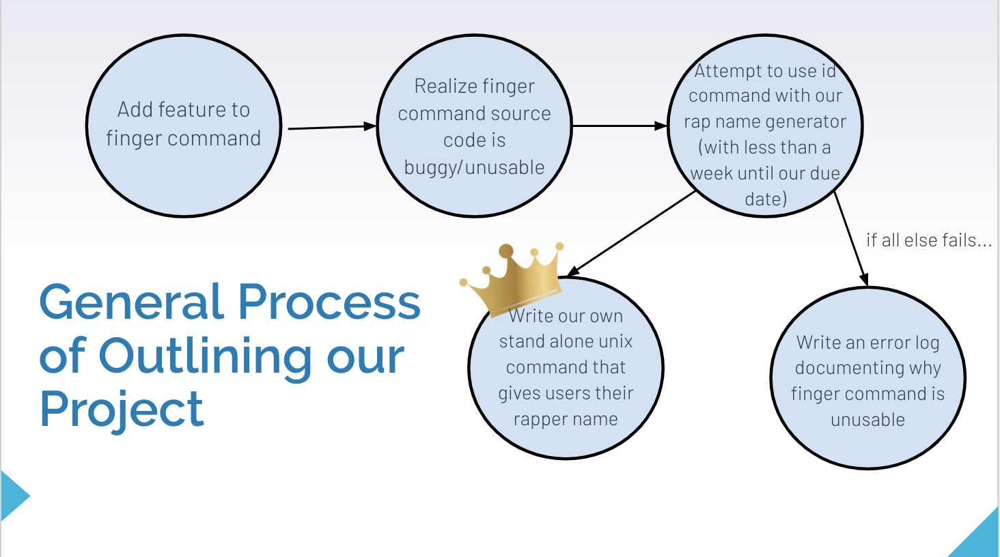

# Rapper Name Generator
Spring 2020 semester project for CMSI 387-Operating Systems done by Shanaya Nagendran, Lauren Lindsey, and KeAnna Anglin.

## Our goal
Our goal is to make a fun unix command that that can take in data about a users name, and output their "Rap Name", which will be determined using the first initial of their first name, and the first initial of their last name (or the last letter in their first name if they have no last name). This Rapper Name comes from a two different first and last name maps from A-Z which map to unique names. The unique rap names were inspried from other rap name generators found online (and some using our own creativity).

For Example:
| Original Name | Rap Name |
| --- | --- | 
| Ray Toal | Grillz Dijon |  
| BJ Johnson | Shawty Playa | 
| Andrew Forney | Lil Computer | 
| John Dionisio | Scumbag Tha Juice | 
| Alex Wong | Lil Pastrami | 
| Masahji Stewart | Krakka Skrt Skrt | 
| Barbara Marino | Shawty Juice Box| 

# How do we plan to do this?
There is an existing unix command called `finger`. The `finger` command outputs the users login and name infromation. We had planned on using this information to generate our rap name.

Unfortunately, the source code for the finger command was buggy and usable. There were even comments in the code saying things like "doesn't work?" and "???". When trying to `make` this command using Ubuntu, we ran into all sorts of problems that ultimately led to us not being able to use the `finger` command for our project. We had to shift gears and find another solution. The following is a diagram of our process of deciding what we were going to do for our project: 

Another roadblock we ran into was that 2/3 of our group members did not have enough space on our laptops for Ubuntu/Virtual Box, and the one that did was only able to download and older version of Ubuntu, making the tutorial steps different and caused more problems. After messing around with a few other ideas, ultimately we decided to make our own unix command that outputs a rapper name. 

# Adding a System Call
In order to do this, we followed a Medium article that had information about adding a system call to the linux kernel. Unfortunatley, this article was outdated so we had to find the correct linux kernel version to proceed. We created a file called `Rapname.c` that takes in command line arguments for the first and last names. `Rapname.c` then converts the first inital and last initial into ascii values and those values are then mapped to the appropriate rap name, which is then printed out in the console. 

Here is what it looks like:

First, the user compiles the code and the program prompts the user for a first and last name

Then, the user checks the kernel logs for their unique Rapper Name!

